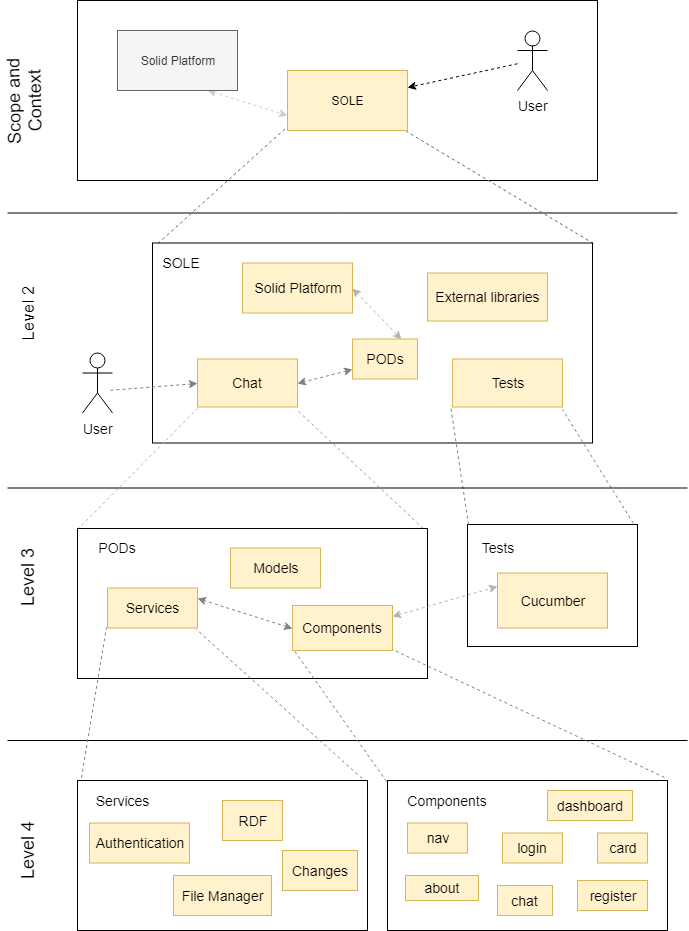

[[section-building-block-view]]

== Building Block View

Sole is basically implemented using the Solid Platform which has provided the foundations of the project and we also rely in Angular for the structure of the project. 
Mainly what Sole does is providing the users with a decentralized chat where they could send messages to each other and store them in their own PODs.

To build this application we used (as previously explained) the Solid Platform that uses PODs, external libraries and tests. Everything managed by the user. 

Inside this POD we can login our own POD, there are models, services, there’s also the chat which is the one the user will access later. In the Tests part we are using mainly cucumber to make user stories tests.
-The services used are authentication, file manager and rdf. 
-The main advantage of the chat is that it is decentralized and this makes possible for you to keep your data safe, no one else could see what your messages are or who are you sending those messages to. 

=== Whitebox Overall System

TODO: describe the decomposition of the overall system using the white box template.

=== Building Block View Diagram 

=== Level 2

TODO: specify the inner structure of (some) building blocks from level 1 as white boxes.

=== Level 3

TODO: specify the inner structure of (some) building blocks from level 1 as white boxes.

MORE INFO: helpForDocumentation/buildingBlockView
