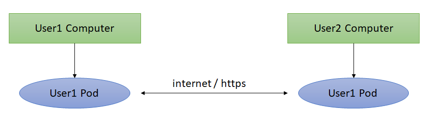

[[section-system-scope-and-context]]
== System Scope and Context

As we are going to create a decentralized chat, we have some limitations, most are not easily usable, struggle with liquidity, do not provide fiat payments but they are also more secure, privacy and personal data are safe. This is why we can not pretend to do the same as what we would do with a centralized application. 

This decentralized chat is based on the Solid pod. The limitations we will have are going to be the same as the ones that this Solid pod has. This interface is also the one that manages the users and that can connect them by the chat.

=== Business Context

First of all, we have to describe the communication partners that are, mainly, the users.
The users are going to be those who want to communicate between them in a safety and efficient environment. For example, members of an enterprise that need to send requests at a very high speed and in the most safety way. In that case they would prefer a decentralized chat than a centralized one.
It can be independent users, like friends, not only enterprise members.

In the environment of the system only “basic information” of each user is going to be shared, like the user name or the e-mail address.
Critical information like bank credentials or ID is not going to be visible (and probably not necessary in any part of the program).

=== Technical Context

Our application will be a web application, for it to be decentralized, the data will be stored in the Pods of the users. So our application should be connected to the internet.

The users will communicate with one another through URLs, that is, through the internet, without the need of a central place to store the data.

In this way, two users will communicate through internet, using their respective Pods.

.Technical context diagram

|===
|Object |Description

|UserX Computer |Represents a user X, more precisely, the computer of user X, that wants to access the application.

|UserX Pod |Represents the Pod of user X, this Pod is a Solid Pod and will be the place where the data from user X are stored.

|internet / https |This means the two users will communicate using internet with the HTTPS protocol.
|===